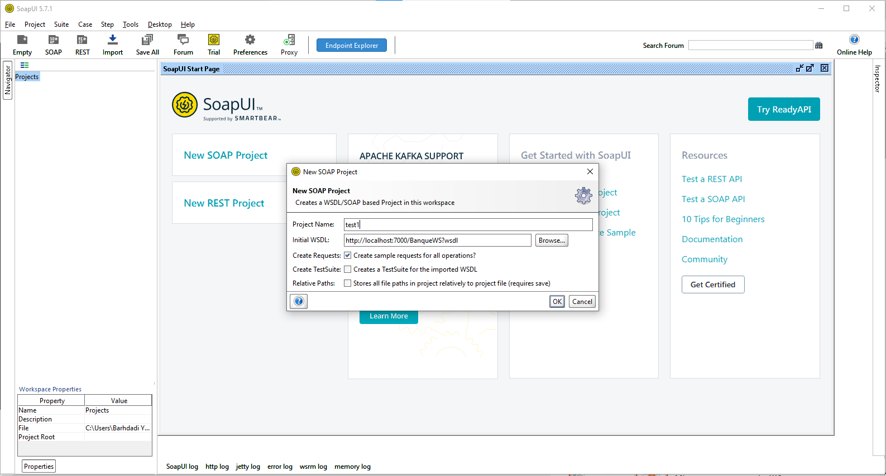
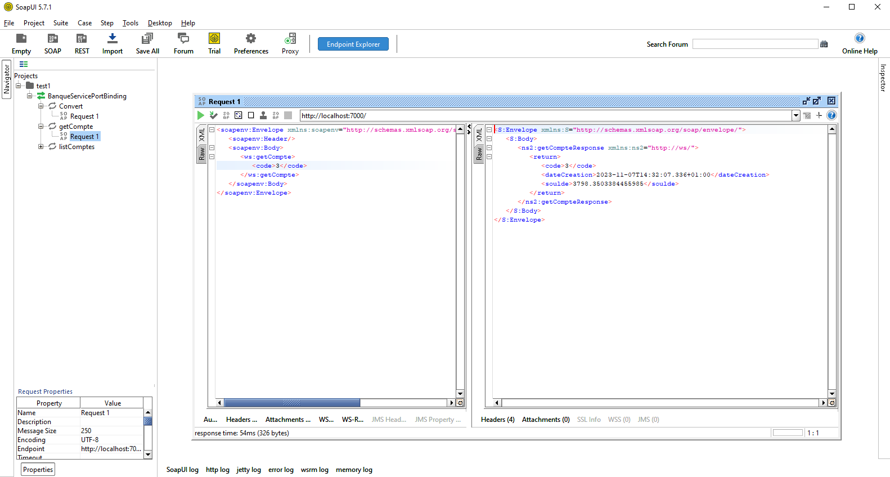
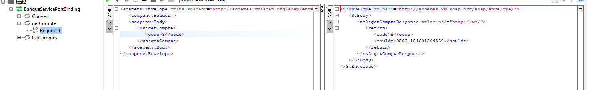
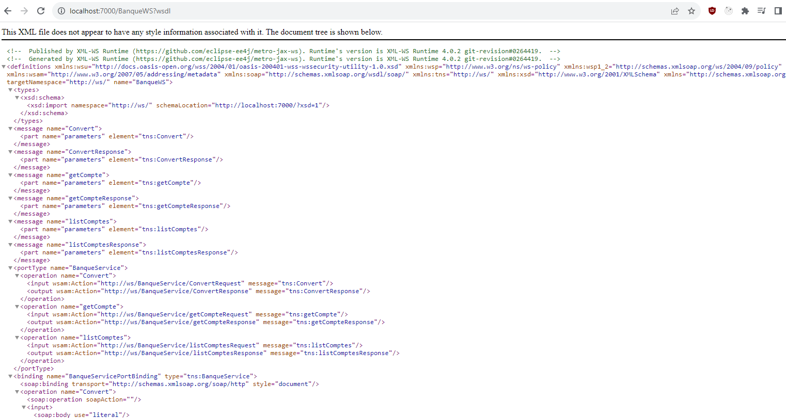
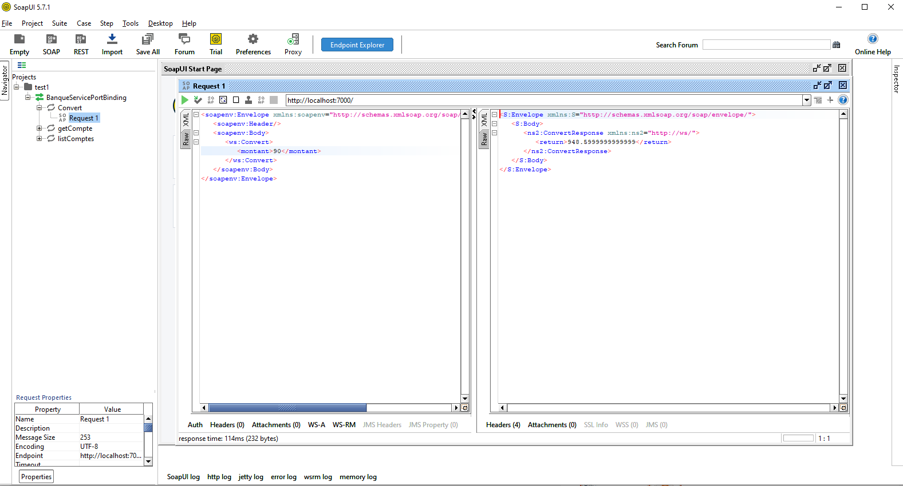
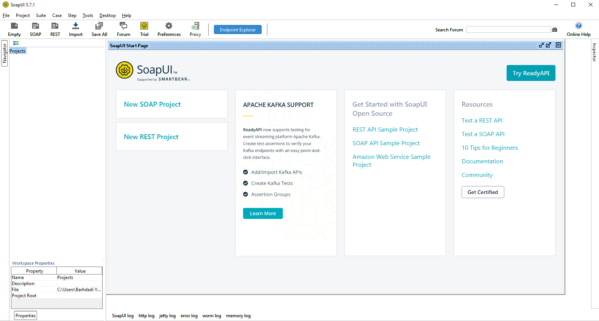
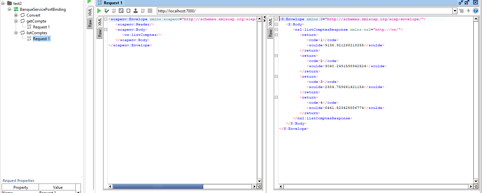
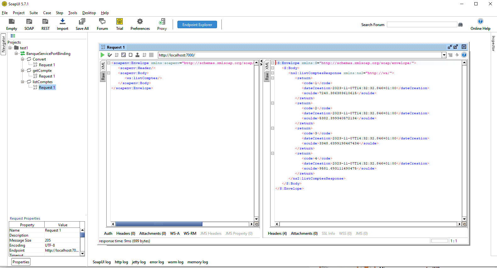
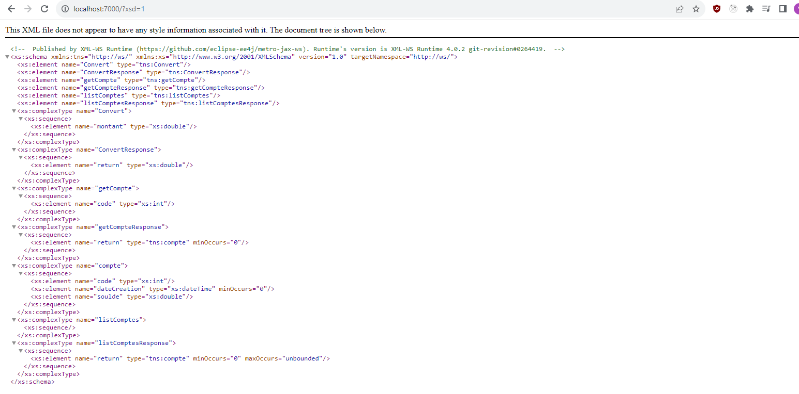
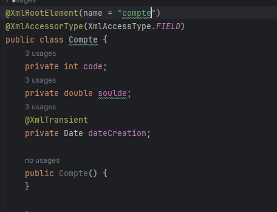

# SpringBoot-SOAP-WSDL
**Project Structure:**

- Start with a Spring Boot project using Maven or Gradle.
- Use the `spring-boot-starter-web-services` dependency to include the necessary libraries for SOAP web services.

**SOAP Service Class:**

- Create a service class (`MySoapService` in the example) annotated with `@Service` and `@WebService`.
- Define methods within the class and annotate them with `@WebMethod` to expose them as operations in the SOAP service.

**Configuration Class:**

- Create a configuration class (`WebServiceConfig` in the example) annotated with `@Configuration` and `@EnableWs`.
- Extend `WsConfigurerAdapter` to configure the SOAP endpoint.
- Create a `MessageDispatcherServlet` bean to handle SOAP messages.
- Define a bean for `DefaultWsdl11Definition` to specify the WSDL location and service name.

**WSDL File:**

- Create a WSDL file (e.g., `mySoapService.wsdl`) and place it in the `src/main/resources/wsdl` directory.
- The WSDL file defines the structure of the web service, including elements, types, and operations.

**Endpoint Mapping:**

- The `@Bean` annotation in the configuration class maps the SOAP service bean (`mySoapService`) to the specified WSDL file.

**Running the Application:**

- When the Spring Boot application is run, it automatically exposes the SOAP web service endpoint.
- Access the WSDL file by appending `?wsdl` to the endpoint URL (e.g., [http://localhost:8080/soap-endpoint?wsdl](http://localhost:8080/soap-endpoint?wsdl)).

**Testing the SOAP Service:**

- Use SOAP clients or tools to test the exposed operations, sending SOAP requests and receiving responses.

This setup allows for the creation of a SOAP-based web service in a Spring Boot application, and clients can interact with it using the generated WSDL for understanding the service contract and data types.
**Screenshots:**

    
    
    
    
    
    
    
    
    
    

